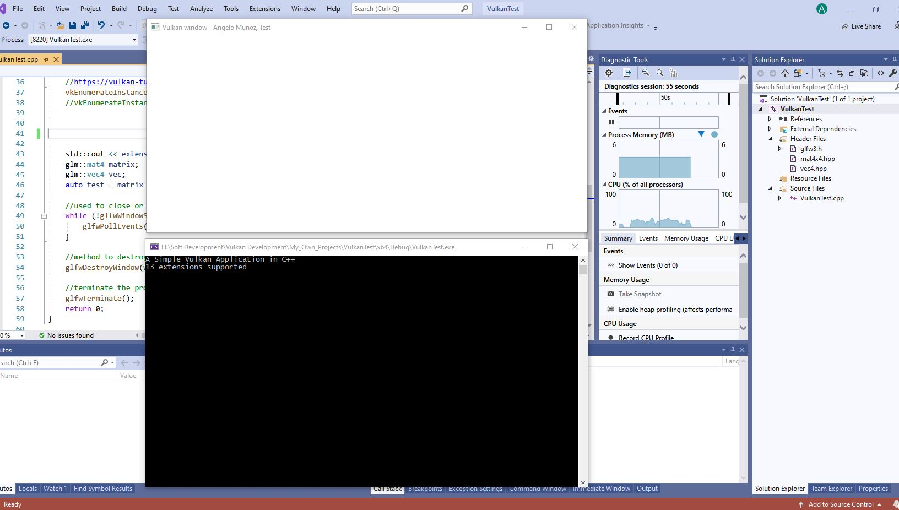

# VulkanC-and-Cpp-BasicExamples
### VulkanTest

This is basic Vulkan implementation of the code found here in [Vulkan Tutorial]. The application will create a GLFW window (Graphics Library Framework). A command prompt window will show number of extensions available for the device (graphic card), and any other information that the programmer wants to show.

License
----

GNU General Public

   [Vulkan Tutorial]: <https://vulkan-tutorial.com/>
